# Documentation

## Getting started
Follow the steps below after logging in to your Orb Portal to get an Agent up and running.

### Register a new account

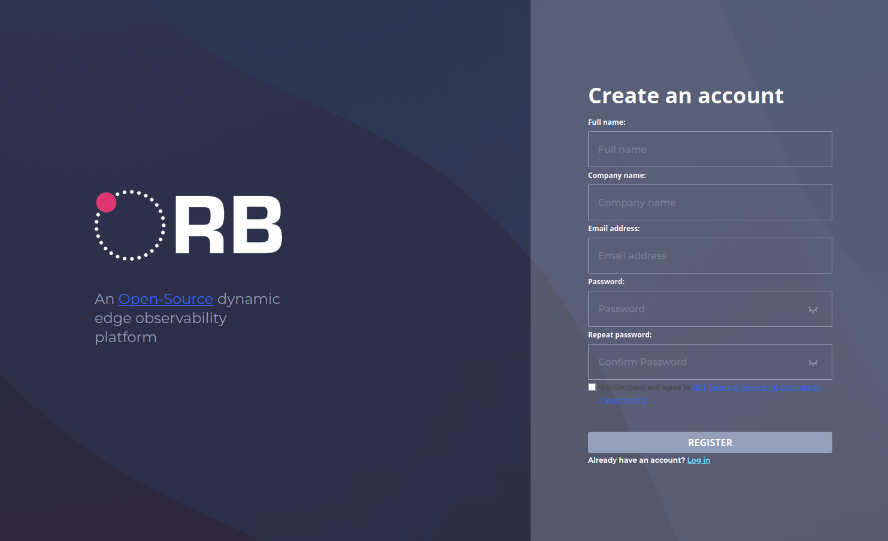

After registering, you should see the home page with a welcome message.

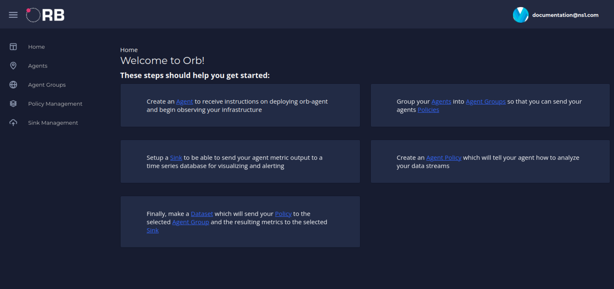

### Create an Agent

You create an Agent for each node you want to monitor. Agents are organized by tags. Each Agent has a set of corresponding credentials used during provisioning. You may also [provision agents directly at the edge](#advanced-auto-provisioning-setup), instead of through the UI.

1. Click **New Agent**.


2. Fill in an *Agent Name* and click **Next**.


3. Fill in the *Key* and *Value* tags, then click the **+** on the right side of the menu. These tags represent the way you will assign the agent to an Agent Group. Reasonable tags might be "location", "region", "pop", "type", etc. 
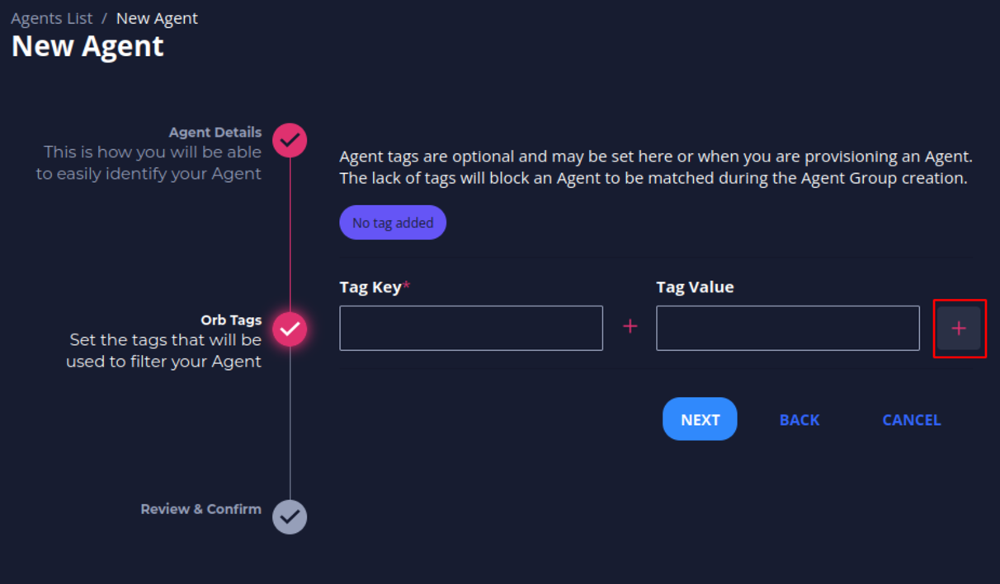

4. You should see an icon with your key and value tags appear above the *Key* and *Value* textboxes. Click **Next**.
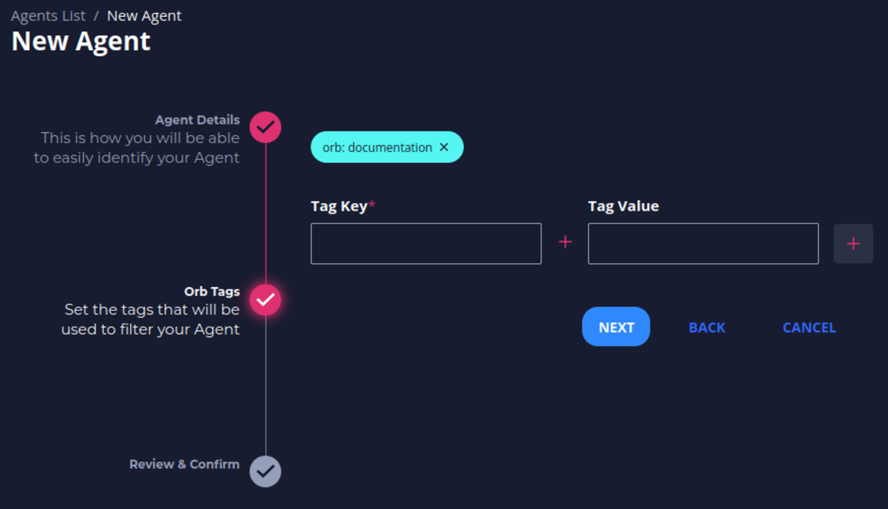

5. Click **Save** to confirm your Agent’s name and tags.  
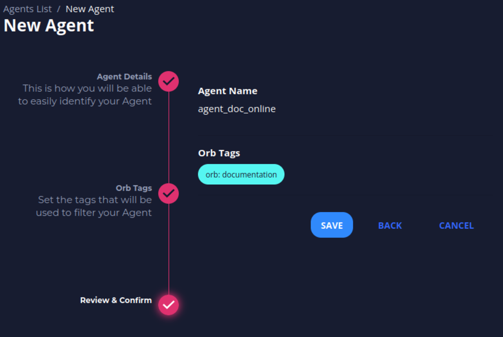

6. Your Agent credentials should appear. Copy the *Provisioning Command*.
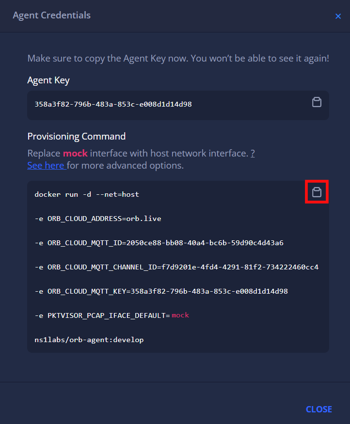

7. Paste the *Provisioning Command* into your terminal (optionally edit "mock" to be real) and run the command. See [Running Orb Agent](/docs/#running-orb-agent) for more details.

8. Refresh the *Agents List* in UI. The Agent you just created should display an *Online* status.


### Create an Agent Group

Agents are organized into groups based on tag matching.

1. Click **New Agent Group**.


2. Fill in an *Agent Group Name* and click **Next**.
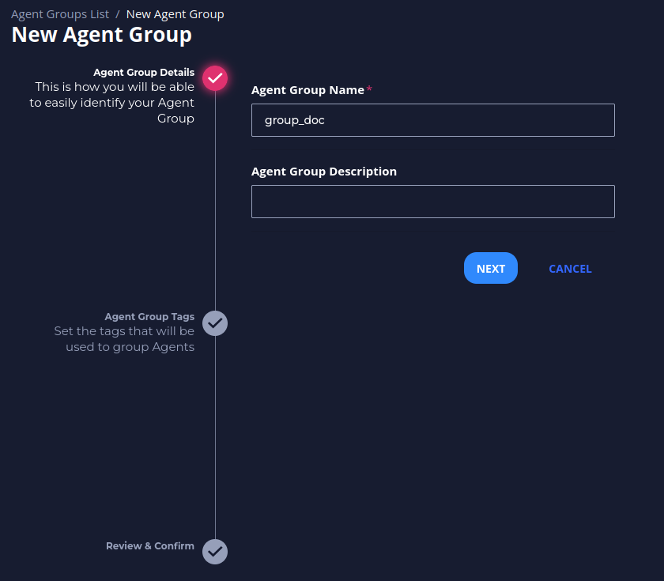

3. Fill in the *Key* and *Value* tags, **which need to match the tags of the corresponding Agent**, and click the **+** on the right side of the menu. You should see an icon with your key and value tags appear above the *Key* and *Value* textboxes.
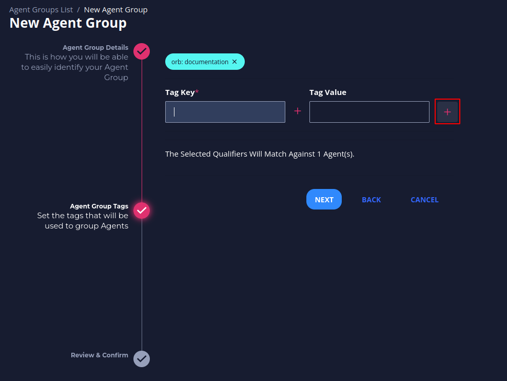

4. Click **Next**. You should see a message about the number of agents matching. Then click **Save**.


5. View the newly created group in the *Agent Groups* list.


6. Click the number in the *Agents* column to view the matching agents.
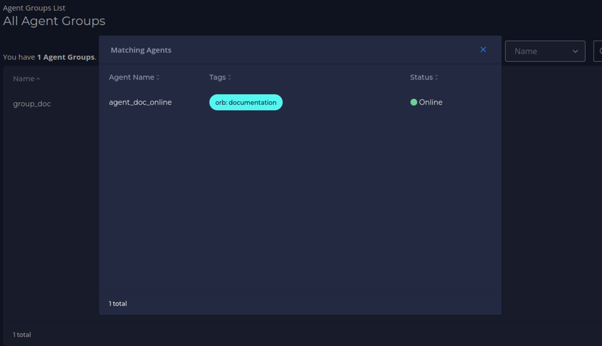

### Create a Sink

A Sink is a location to send the metrics collected from the Agents. The current version supports Prometheus, and future versions will support more options. You can use a private Prometheus instance or use a free [Grafana Cloud](https://grafana.com/products/cloud/) account as a Sink.

1. Click **New Sink**.


2. Fill in a sink name and click **Next**.
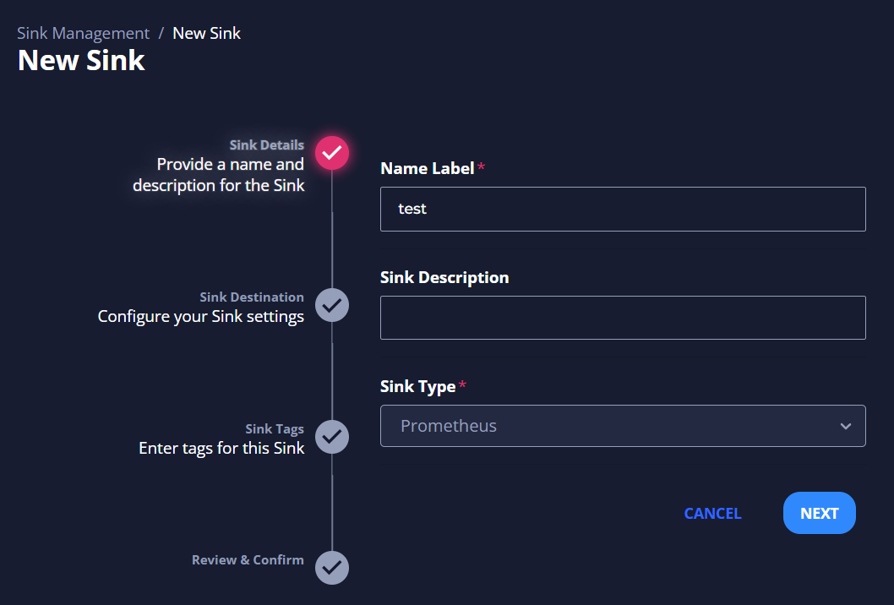

3. Fill in your sink destination details. This includes the host/username/password from your Prometheus `remote_write` configuration.
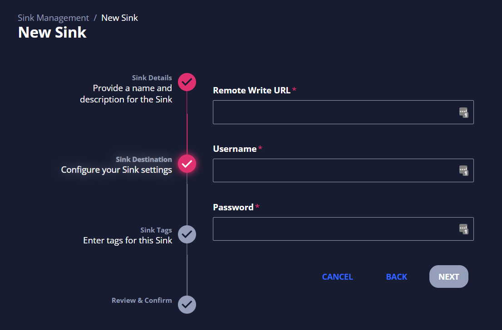

4. Optionally, add sink tags by filling in the *Key* and *Value* fields. Click **+** after each key-value pair, and them click **Next**.


5. Review and confirm your sink details and click **Save**.
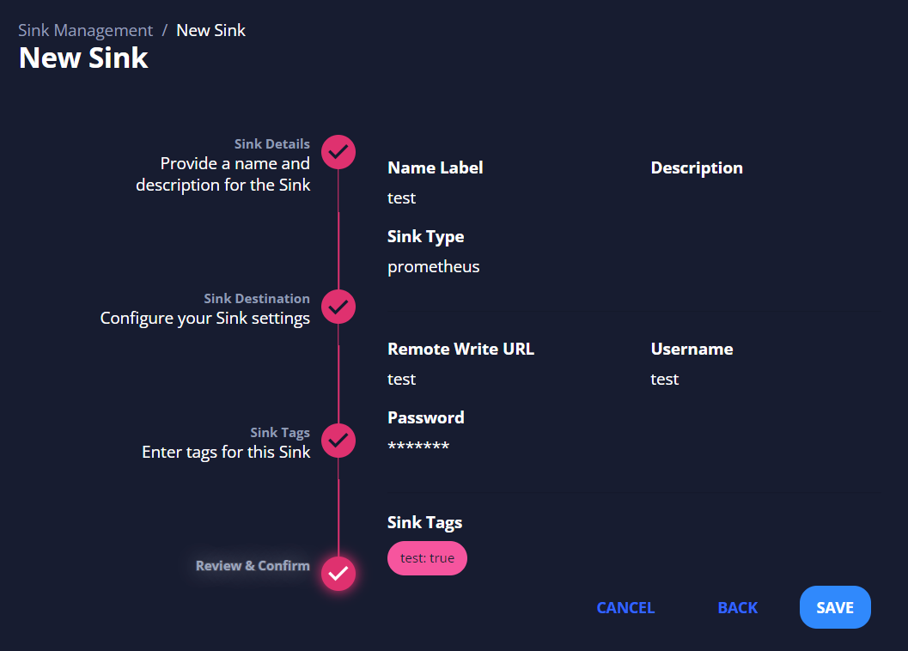

6. View your newly created Sink in the *All Sinks* list.


### Create a Policy

 Policies are the recipes sent to Agents that describe which metrics to collect.

1. Click **New Policy**.


2. Fill in a policy name and (optionally) a description. The policy name needs to be unique and cannot contain spaces (use underscores or dashes instead). Then click **Next**.


3. Select the *Tap* (input stream) to analyze. In this example, we use “default_pcap” which is the default for Packet Capture. All other options are advanced and can be left as is. Click **Next** when finished.
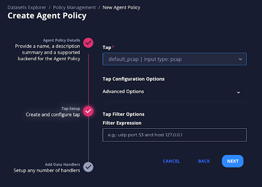

4. Click **Add Handler** to add a *Stream Handler* to the policy, which specifies how to analyze the input stream selected in the previous step.


5. Add a *Handler Label* for each handler you add. In this example, we want to analyze DNS traffic, so we select the “dns” handler. The only required field here is the *Handler Label*, which is automatically generated for you (handler_dns_1 in this case).
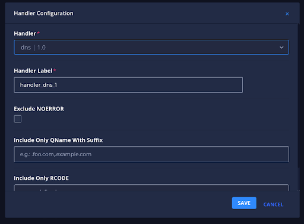

6. Enter any customization variables. In this example, we customize the analysis by only analyzing domain names ending in “.ua” or “.ru”. This is done with the filter labeled “Include Only QNames With Suffix”. We input a comma delimited list of suffixes, so enter “.ua,.ru”. Click **Save** after entering any customization to save this Handler.
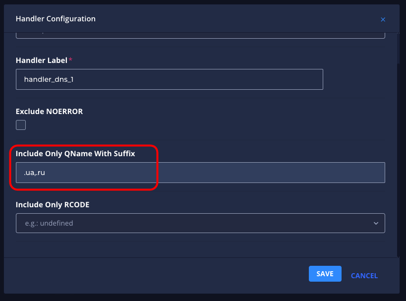

7. You should see your new handler label on the screen. Optionally, add more handlers. Click **Save** to save the policy.
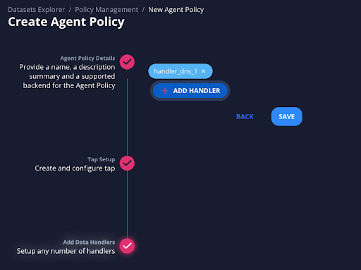


### Create a Dataset

Datasets tie all of the previous pieces together: they describe _which Agents_ to send _which Policy_, and _where to "sink"_ the resulting metrics.

1. Click **New Set**.


2. Fill in a label name for the dataset. Click **Next**.


3. Select an Agent Group from the drop-down. Click **Next**.

4. Select the desired policy from the drop-down. Click **Next**.

5. Select the desired sink from the drop-down. Click **+** after selecting each sink. and then click **Next**.

8. Check your Sink status in UI and confirm it is *Active*.

### Visualize and alert on your metrics

1. Your Agent should now be running the Policy you created. After 1 minute of collection time, the metrics will be sent to your Prometheus sink.
2. You may use standard tools for visualizing and alerting on your Prometheus metrics. A popular option is [Grafana](https://grafana.com).
3. A pre-made dashboard for visualizing Orb/pktvisor metrics is [available for import here](https://grafana.com/grafana/dashboards/14221).
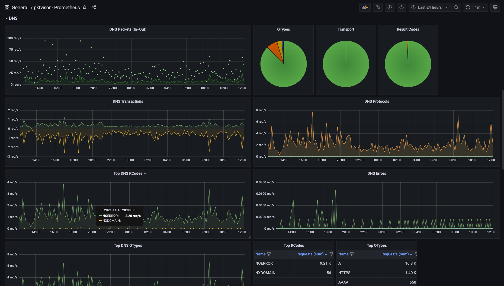

## Running Orb Agent

An Orb agent needs to run on all infrastructure (computers, servers, switches, VMs, k8s, etc.) to be monitored. It is a small, lightweight docker process with an embedded [pktvisor agent](https://pktvisor.dev) which connects into the Orb control plane to receive policies and send its metric output.

To run an agent, you will need:

1. Docker, to run the agent image ([ns1labs/orb-agent:develop](https://hub.docker.com/repository/docker/ns1labs/orb-agent))
2. [Agent Credentials](#agent-credentials), which are provided to you by the Orb UI or REST API after [creating an Agent](/docs/#create-an-agent)
3. The Orb Control Plane host address (e.g. `localhost` or `orb.live`)
4. The network interface to monitor (e.g. `eth0`)

!!! tip 

    If you are unsure which network interface to monitor, you may list the available interfaces on your host. Note that to allow 
    the agent access to these interfaces, you must run the container with `--net=host`
    

    === "Linux"

        ``` shell 
        ip -stats -color -human addr
        ```


    === "OSX"

        ``` shell 
        ifconfig
        ```

### Agent credentials 

The Agent credentials include *three pieces of information*, each of which is a UUID in the form `5dc34ded-6a53-44c0-8d15-7e9c8c95391a`.

1. **Agent ID**, which uniquely identifies the agent.
2. **Agent Channel ID**, which uniquely identifies the agent's communication channel.
3. **Agent Key**, which is a private access token for the agent. Note you will only be shown the key once upon creation!

### Sample provisioning commands
!!! example  

    === "Generic"

        Use this command as a template by substituting in the appropriate values:

        ``` shell 
        docker run -d --net=host
        -e ORB_CLOUD_ADDRESS=<HOST>
        -e ORB_CLOUD_MQTT_ID=<AGENTID>
        -e ORB_CLOUD_MQTT_CHANNEL_ID=<CHANNELID>
        -e ORB_CLOUD_MQTT_KEY=<AGENTKEY>
        -e PKTVISOR_PCAP_IFACE_DEFAULT=mock
        ns1labs/orb-agent:develop
        ```
    === "localhost, mock"
        
        This command is useful for connecting to a local develop environment, perhaps running on [Docker compose](/install/#orb-with-docker-compose). 
        Note that the "mock" interface will generate random traffic rather than observe real traffic.

        ``` shell 
        docker run -d --net=host
        -e ORB_CLOUD_ADDRESS=localhost
        -e ORB_CLOUD_MQTT_ID=7fb96f61-5de1-4f56-99d6-4eb8b43f8bad
        -e ORB_CLOUD_MQTT_CHANNEL_ID=3e60e85d-4414-44d9-b564-0c1874898a4d
        -e ORB_CLOUD_MQTT_KEY=44e42d90-aaef-45de-9bc2-2b2581eb30b3
        -e PKTVISOR_PCAP_IFACE_DEFAULT=mock
        -e ORB_TLS_VERIFY=false
        ns1labs/orb-agent:develop
        ```

    === "orb.live, eth0"
        
        This command is similar to one you would use on the orb.live SaaS platform

        ``` shell 
        docker run -d --net=host
        -e ORB_CLOUD_ADDRESS=orb.live
        -e ORB_CLOUD_MQTT_ID=7fb96f61-5de1-4f56-99d6-4eb8b43f8bad
        -e ORB_CLOUD_MQTT_CHANNEL_ID=3e60e85d-4414-44d9-b564-0c1874898a4d
        -e ORB_CLOUD_MQTT_KEY=44e42d90-aaef-45de-9bc2-2b2581eb30b3
        -e PKTVISOR_PCAP_IFACE_DEFAULT=eth0
        ns1labs/orb-agent:develop
        ```

!!! question 

    Is the Agent docker image not starting correctly? Do you have a specific use case? Have you found a bug? Come talk to us [live on Slack](https://join.slack.com/t/ns1labs/shared_invite/zt-qqsm5cb4-9fsq1xa~R3h~nX6W0sJzmA),
    or [file a GitHub issue here](https://github.com/ns1labs/orb/issues/new/choose).

### Configuration files

Most configuration options can be passed to the container as environment variables, but there are some situations that require a configuration file.

You will need to use a configuration file if:

* You want to assign tags to the Agent at the edge
* You want to setup custom pktvisor Taps
* You want the Agent to [auto-provision](#advanced-auto-provisioning-setup)

The configuration file is written in YAML. 
You can use the latest [template configuration file](https://raw.githubusercontent.com/ns1labs/orb/develop/cmd/agent/agent.example.yaml) as a starting point, or
start here:

```yaml
version: "1.0"

# this section is used by pktvisor
# see https://github.com/ns1labs/pktvisor/blob/develop/RFCs/2021-04-16-75-taps.md
visor:
   taps:
      default_pcap:
         input_type: pcap
         config:
            iface: "eth0"
            host_spec: "192.168.0.54/32,192.168.0.55/32,127.0.0.1/32"

# this section is used orb-agent
# most sections and keys are optional
orb:
   # these are arbitrary key value pairs used for organization in the control plane and UI
   tags:
      region: EU
      pop: ams02
      node_type: dns
   cloud:
      config:
         # optionally specify an agent name to use during auto provisioning
         # hostname will be used if it's not specified here
         agent_name: my-agent1
         auto_provision: true
      api:
         address: https://orb.live
         # if auto provisioning, specify API token here (or pass on the command line)
         token: TOKEN
      mqtt:
         address: tls://orb.live:8883
         # if not auto provisioning, specify agent connection details here
         id: "AGENT_UUID"
         key: "AGENT_KEY_UUID"
         channel_id: "AGENT_CHANNEL_UUID"
```

You must mount your configuration file into the `orb-agent` container. For example, if your configuration file
is on the host at `/local/orb/agent.yaml`, you can mount it into the container with this command:

```shell
docker run -v /local/orb:/usr/local/orb/ --net=host \
      ns1labs/orb-agent:develop run -c /usr/local/orb/agent.yaml
```

### Advanced auto-provisioning setup
Some use cases require a way to provision agents directly on edge infrastructure without creating an agent manually in the UI or REST API ahead of time. To do so, you will need to create an API key which can be used by `orb-agent` to provision itself.

!!! warning

    Auto-provisioning is an advanced use case. Most users will find [creating an Agent in the UI](/docs/#create-an-agent) easier.

1. If you have not already done so, register a new account with an email address and password at https://HOST/auth/register.

2. Create a `SESSION_TOKEN` with the `EMAIL_ADDRESS` and `PASSWORD` from registration:

        curl --location --request POST 'https://HOST/api/v1/tokens' \
        --header 'Content-Type: application/json' \
        --data-raw '{
        "email": "<EMAIL_ADDRESS>",
        "password": "<PASSWORD>"
        }'

3. The output from creating a session token looks like this:

        {
            "token": "SESSION_TOKEN"
        }

4. Because session tokens expire after 24 hours, you can create a permanent API token for agent provisioning by using the `SESSION_TOKEN` above:

        curl --location --request POST 'https://HOST/api/v1/keys' \
        --header 'Authorization: <SESSION_TOKEN>' \
        --header 'Content-Type: application/json' \
        --data-raw '{
        "type": 2
        }'

5. The output from creating a `PERMANENT_TOKEN` looks like the following. Please take note of the `id` (used later to revoke) and the `value` (the permanent API token):

        {
            "id": "710c6a92-b463-42ec-bf24-8ae24eb13081",
            "value": "PERMANENT_TOKEN",
            "issued_at": "2021-09-07T15:29:49.70146088Z"
        }

6. **Currently, the permanent token allows access to all API functionality, not just provisioning.** You can revoke this permanent token at any time with the following call, using the `id` field above:

        curl --location --request DELETE 'HOST:80/api/v1/keys/<PERMANENT_TOKEN_ID>' \
        --header 'Authorization: <SESSION_TOKEN>'

7. Create a config for Orb and pktvisor taps, for example, `/local/orb/agent.yaml`:
```yaml
version: "1.0"

visor:
   taps:
      ethernet:
         input_type: pcap
         config:
            iface: "eth0"

orb:
   db:
      file: /usr/local/orb/orb-agent.db
   tags:
      region: EU
      pop: ams02
      node_type: dns
   cloud:
      config:
         agent_name: myagent1
      api:
         address: https://HOST
      mqtt:
         address: tls://HOST:8883
```

8. You can now pull and run `ns1labs/orb-agent:develop` to auto-provision, substituting in the `PERMANENT_TOKEN` and optionally configuring agent name and Orb tags. If you don't set the agent name, it will attempt to use a hostname. You must mount the directory to save the agent state database and the config file:

```shell
docker pull ns1labs/orb-agent:develop
docker run -v /local/orb:/usr/local/orb/ --net=host \
       -e ORB_CLOUD_API_TOKEN=<PERMANENT_TOKEN> \
      ns1labs/orb-agent:develop run -c /usr/local/orb/agent.yaml
```

## Working with API Docs
Follow the links below for API documentation of each respective Orb microservice:

* [Fleet](https://getorb.io/api/fleet.html)
* [Policies](https://getorb.io/api/policies.html)
* [Sinks](https://getorb.io/api/sinks.html)
